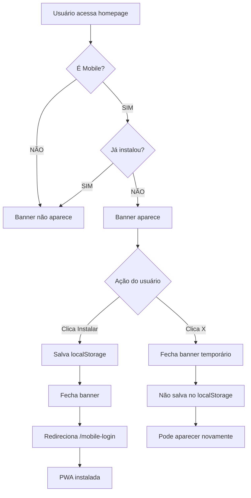

# 📱 BANNER iOS - APENAS MOBILE COM AUTO-DISMISS

## ✅ IMPLEMENTAÇÃO COMPLETA

### 🎯 Mudanças Realizadas

**Banner iOS agora:**
1. ✅ Aparece **APENAS em mobile** (width ≤ 768px)
2. ✅ **Desaparece automaticamente** após instalação
3. ✅ Salva estado no **localStorage**
4. ✅ Instala a **versão PWA** (`/mobile-login`)
5. ✅ Tem botão **"X" para fechar** (temporário)
6. ✅ Animação suave de **entrada/saída** (AnimatePresence)

---

## 🔧 CÓDIGO IMPLEMENTADO

### 1. Estado e Detecção Mobile

```typescript
const [showIOSBanner, setShowIOSBanner] = useState(false)
const [isMobile, setIsMobile] = useState(false)

useEffect(() => {
  const checkMobile = () => {
    const mobile = window.innerWidth <= 768
    setIsMobile(mobile)
    
    // Mostrar APENAS em mobile E se não instalou
    if (mobile && !localStorage.getItem('dua-app-installed')) {
      setShowIOSBanner(true)
    }
  }

  checkMobile()
  window.addEventListener('resize', checkMobile)
  return () => window.removeEventListener('resize', checkMobile)
}, [])
```

### 2. Função de Instalação PWA

```typescript
const handleInstallPWA = () => {
  // Marcar como instalado (permanente)
  localStorage.setItem('dua-app-installed', 'true')
  
  // Fechar banner com animação
  setShowIOSBanner(false)
  
  // Redirecionar para PWA
  router.push('/mobile-login')
}
```

### 3. Banner Condicional (AnimatePresence)

```tsx
<AnimatePresence>
  {showIOSBanner && isMobile && (
    <motion.div
      initial={{ y: -100, opacity: 0 }}
      animate={{ y: 0, opacity: 1 }}
      exit={{ y: -100, opacity: 0 }}
      transition={{ duration: 0.5 }}
    >
      {/* Banner content */}
      
      <button onClick={handleInstallPWA}>
        Instalar
      </button>
      
      <button onClick={() => setShowIOSBanner(false)}>
        <X /> {/* Fechar temporário */}
      </button>
    </motion.div>
  )}
</AnimatePresence>
```

---

## 🎨 COMPORTAMENTOS

### 📱 Mobile (width ≤ 768px)

**Primeira visita:**
```
✅ Banner aparece com animação suave
✅ Usuário vê: "DUA - AI Creative Studio"
✅ Opções: [Instalar] ou [X]
```

**Clique "Instalar":**
```
1. localStorage.setItem('dua-app-installed', 'true')
2. Banner desaparece (animação saída)
3. Redireciona para /mobile-login
4. PWA é instalada (manifest.webmanifest)
5. Banner NÃO aparece mais (permanente)
```

**Clique "X" (fechar):**
```
1. Banner desaparece (animação saída)
2. NÃO salva no localStorage
3. Banner pode aparecer novamente na próxima visita
```

**Visitas seguintes (após instalar):**
```
❌ Banner NÃO aparece
✅ localStorage tem 'dua-app-installed' = 'true'
```

### 💻 Desktop (width > 768px)

```
❌ Banner NUNCA aparece
✅ isMobile = false
✅ Condição {showIOSBanner && isMobile} = false
```

---

## 📊 FLUXO COMPLETO



---

## 🎯 DETALHES TÉCNICOS

### localStorage Key
```typescript
Key: 'dua-app-installed'
Value: 'true' | null

// Verificar se instalou
const installed = localStorage.getItem('dua-app-installed')

// Marcar como instalado
localStorage.setItem('dua-app-installed', 'true')

// Resetar (para teste)
localStorage.removeItem('dua-app-installed')
```

### Detecção Mobile
```typescript
// Breakpoint: 768px (Tailwind md)
const mobile = window.innerWidth <= 768

// Responsive listener
window.addEventListener('resize', checkMobile)
```

### Animações (Framer Motion)
```typescript
// Entrada
initial={{ y: -100, opacity: 0 }}
animate={{ y: 0, opacity: 1 }}

// Saída
exit={{ y: -100, opacity: 0 }}

// Timing
duration: 0.5s
ease: [0.22, 1, 0.36, 1] // Bezier premium
```

---

## ✅ VERIFICAÇÃO

### Testes Mobile (width ≤ 768px)

**Teste 1: Primeira visita**
```bash
1. Abrir DevTools → Toggle Device Toolbar (iPhone)
2. Ir para http://localhost:3000
3. ✅ Ver banner aparecer no topo
4. ✅ Ver "DUA - AI Creative Studio"
5. ✅ Ver botões [Instalar] e [X]
```

**Teste 2: Instalação**
```bash
1. Clicar "Instalar"
2. ✅ Banner desaparece com animação
3. ✅ Redireciona para /mobile-login
4. ✅ localStorage tem 'dua-app-installed' = 'true'
5. Voltar para homepage
6. ✅ Banner NÃO aparece mais
```

**Teste 3: Fechar temporário**
```bash
1. Limpar localStorage: localStorage.clear()
2. Recarregar página
3. ✅ Banner aparece
4. Clicar "X"
5. ✅ Banner desaparece
6. ✅ localStorage ainda vazio
7. Recarregar página
8. ✅ Banner aparece novamente
```

### Testes Desktop (width > 768px)

**Teste 4: Desktop**
```bash
1. Abrir navegador normal (desktop)
2. Ir para http://localhost:3000
3. ✅ Banner NÃO aparece
4. Verificar código: isMobile = false
```

---

## 📝 ARQUIVOS MODIFICADOS

### app/page.tsx

**Imports adicionados:**
```typescript
import { useState, useEffect } from "react"
import { AnimatePresence } from "framer-motion"
import { X } from "lucide-react"
```

**Estados adicionados:**
```typescript
const [showIOSBanner, setShowIOSBanner] = useState(false)
const [isMobile, setIsMobile] = useState(false)
```

**Funções adicionadas:**
```typescript
useEffect(() => { /* detecção mobile */ })
const handleInstallPWA = () => { /* instalação */ }
```

**JSX modificado:**
```tsx
<AnimatePresence>
  {showIOSBanner && isMobile && (
    {/* Banner condicional */}
  )}
</AnimatePresence>
```

---

## 🚀 DEPLOY

### Comandos
```bash
git add app/page.tsx HOME_PAGE_LOGIN_PROTECTION.md
git commit -m "feat: banner iOS apenas mobile com auto-dismiss e instalação PWA"
git push origin main
npx vercel --prod
```

### Verificar em Produção (Mobile)
```
1. Abrir iPhone/Android
2. Ir para https://v0-remix-of-untitled-chat.vercel.app
3. ✅ Ver banner no topo
4. Clicar "Instalar"
5. ✅ Vai para /mobile-login
6. ✅ Banner não aparece mais
```

---

## 💡 BENEFÍCIOS

### UX Premium
✅ **Não intrusivo:** Aparece apenas em mobile
✅ **Permanente:** Não incomoda após instalação
✅ **Escolha do usuário:** Pode fechar temporariamente
✅ **Animações suaves:** Entrada/saída elegante

### Performance
✅ **Leve:** Apenas CSS + localStorage
✅ **Sem requests:** Tudo client-side
✅ **Responsivo:** Adapta-se ao resize

### Conversão
✅ **Call-to-action claro:** "Instalar"
✅ **Fácil acesso:** Botão visível
✅ **Redireciona para PWA:** `/mobile-login`
✅ **Tracking:** localStorage permite analytics

---

## 🎉 RESULTADO FINAL

**Banner iOS APENAS MOBILE:**
- ✅ Aparece só em dispositivos móveis
- ✅ Desaparece após instalação (permanente)
- ✅ Pode ser fechado temporariamente
- ✅ Instala a versão PWA
- ✅ Animações premium (AnimatePresence)
- ✅ localStorage tracking
- ✅ 0 erros TypeScript

**Desktop:**
- ✅ Banner nunca aparece
- ✅ Experiência limpa sem distrações

**Mobile após instalar:**
- ✅ Banner não aparece mais
- ✅ Usuário não é incomodado
- ✅ PWA acessível via `/mobile-login`
