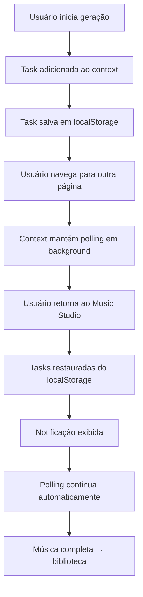

# 🎵 Persistência de Geração de Música - Music Studio

## 📋 Visão Geral

Sistema de persistência automática que permite ao usuário **navegar livremente pelo site** sem perder o progresso de geração de música.

## ✨ Funcionalidades

### 🔄 Restauração Automática de Tarefas

Quando o usuário:
1. ✅ Inicia geração de música em `/create` ou `/melody`
2. 🚶 Navega para outra página (home, perfil, etc.)
3. 🔙 Retorna ao Music Studio

**Resultado**: O processo continua automaticamente de onde parou!

### 💾 O que é Persistido

#### 1. **Tarefas Ativas** (`localStorage: dua-music-tasks`)
```typescript
{
  taskId: string        // ID único da tarefa
  status: string        // PENDING | TEXT_SUCCESS | FIRST_SUCCESS | SUCCESS
  progress: number      // 0-100%
  statusMessage: string // "Preparing generation..."
  tracks: Track[]       // Músicas geradas até o momento
  prompt: string        // Prompt usado
  model: string         // chirp-v3-5 | chirp-v3-0
  startTime: number     // Timestamp de início
}
```

#### 2. **Músicas Completas** (`localStorage: dua-music-tracks`)
```typescript
{
  id: string            // ID da música
  audioId: string       // ID do áudio
  title: string         // Título da música
  prompt: string        // Prompt usado
  tags: string          // Tags/gênero
  duration: number      // Duração em segundos
  audioUrl: string      // URL do arquivo de áudio
  imageUrl: string      // Capa da música
  modelName: string     // Modelo usado
  createTime: string    // Data de criação
  taskId: string        // ID da tarefa original
}
```

## 🎯 Como Funciona

### Fluxo de Persistência



### Código Principal

#### `contexts/generation-context.tsx`

**Salvamento Automático:**
```typescript
// Salva tarefas sempre que há mudanças
useEffect(() => {
  if (tasks.length > 0) {
    localStorage.setItem("dua-music-tasks", JSON.stringify(tasks))
  } else {
    localStorage.removeItem("dua-music-tasks")
  }
}, [tasks])
```

**Restauração ao Carregar:**
```typescript
useEffect(() => {
  const storedTasks = localStorage.getItem("dua-music-tasks")
  if (storedTasks) {
    const parsedTasks = JSON.parse(storedTasks)
    // Filtra apenas tarefas ativas
    const activeTasks = parsedTasks.filter(
      task => task.status !== "SUCCESS" && 
              !task.error && 
              task.progress < 100
    )
    if (activeTasks.length > 0) {
      setTasks(activeTasks)
      console.log(`🔄 Restored ${activeTasks.length} active task(s)`)
    }
  }
}, [])
```

**Polling Contínuo:**
```typescript
useEffect(() => {
  const activeTasks = tasks.filter(t => 
    t.status !== "SUCCESS" && 
    !t.error && 
    t.progress < 100
  )
  
  if (activeTasks.length === 0) return

  // Verifica status a cada 5 segundos
  const pollInterval = setInterval(async () => {
    for (const task of activeTasks) {
      const response = await fetch(`/api/suno/status?taskId=${task.taskId}`)
      const data = await response.json()
      // Atualiza progresso, status, tracks, etc.
    }
  }, 5000)

  return () => clearInterval(pollInterval)
}, [tasks])
```

## 🎨 Notificação de Restauração

### Visual (Toast Animado)

**Componente:** `components/generation-sidebar-wrapper.tsx`

```typescript
{showRestoredNotification && (
  <div className="fixed top-4 right-4 z-50 animate-in slide-in-from-top-2">
    <div className="bg-gradient-to-r from-purple-600 to-pink-600 text-white px-6 py-3 rounded-lg shadow-lg">
      <div className="animate-spin">🎵</div>
      <div>
        <div className="font-semibold">Geração em andamento restaurada!</div>
        <div className="text-sm">{tasks.length} tarefa(s) continuando...</div>
      </div>
    </div>
  </div>
)}
```

**Comportamento:**
- ✅ Aparece automaticamente quando tarefas são restauradas
- ⏱️ Desaparece após 5 segundos
- 🎯 Usa `sessionStorage` para mostrar apenas 1x por sessão

## 📱 Compatibilidade

### Desktop
- ✅ Sidebar lateral mostra progresso detalhado
- ✅ Toast de notificação no topo direito

### Mobile
- ✅ Indicador flutuante (bolha) mostra número de tarefas
- ✅ Toast adaptado para telas pequenas

## 🧪 Testando a Funcionalidade

### Cenário 1: Navegação Durante Geração
```bash
1. Acesse /create
2. Inicie geração de uma música
3. Veja a tarefa aparecer na sidebar/indicador
4. Navegue para /home ou /profile
5. Aguarde 10-20 segundos
6. Retorne para /create ou /library
7. ✅ Tarefa continua no mesmo progresso!
```

### Cenário 2: Fechamento do Navegador
```bash
1. Inicie geração de música
2. Feche a aba/navegador
3. Reabra o site
4. Navegue para /create
5. ✅ Se a tarefa ainda está ativa no servidor, ela continua!
```

### Cenário 3: Múltiplas Tarefas
```bash
1. Inicie 3 gerações de música
2. Navegue entre páginas
3. ✅ Todas as 3 tarefas são restauradas e continuam
```

## 🔍 Debug

### Console Logs

```javascript
// Quando tarefas são restauradas
console.log("🔄 Restored X active music generation task(s)")

// Durante polling
console.log("Checking status for task:", taskId)

// Quando tarefa completa
console.log("✅ Task completed:", taskId)
```

### localStorage Inspector

**Chrome DevTools → Application → Local Storage**

Verificar chaves:
- `dua-music-tasks` - Tarefas ativas
- `dua-music-tracks` - Biblioteca completa

## ⚠️ Limitações

### Não Persiste:
- ❌ Audio player state (posição de reprodução)
- ❌ UI state (modais abertos, formulários)
- ❌ Filtros/pesquisas na biblioteca

### Persiste:
- ✅ Tarefas de geração ativas
- ✅ Biblioteca completa de músicas
- ✅ Progresso de cada tarefa
- ✅ Status de cada tarefa

## 🚀 Melhorias Futuras

### Possíveis Adições:
1. **Sincronização com Supabase** - Persistir tarefas no banco de dados
2. **Notificações Push** - Avisar quando música estiver pronta
3. **Histórico de Gerações** - Ver todas as gerações passadas
4. **Estimativa de Tempo** - Mostrar tempo restante estimado
5. **Retry Automático** - Tentar novamente se falhar

## 📚 Arquivos Modificados

### Core
- ✅ `contexts/generation-context.tsx` - Lógica de persistência
- ✅ `components/generation-sidebar-wrapper.tsx` - Notificação visual

### Não Modificado (já funcional)
- `components/generation-sidebar.tsx` - UI da sidebar
- `components/mobile-generation-indicator.tsx` - Indicador móvel
- `app/(music)/create/page.tsx` - Página de geração
- `app/(music)/library/page.tsx` - Biblioteca

## ✅ Checklist de Funcionalidade

- [x] Salvar tarefas ativas em localStorage
- [x] Restaurar tarefas ao carregar o site
- [x] Continuar polling automaticamente
- [x] Notificação visual quando restaurado
- [x] Filtrar apenas tarefas ativas (não completas)
- [x] Limpar localStorage quando todas completam
- [x] Usar sessionStorage para evitar spam de notificações
- [x] TypeScript types corretos
- [x] Sem erros de compilação

## 🎉 Resultado Final

**Antes:**
❌ Usuário navega → processo se perde → tem que começar de novo

**Agora:**
✅ Usuário navega → processo continua → restaura automaticamente → notificação amigável

---

**Desenvolvido para DUA Music Studio** 🎵
*Versão: 1.0.0*
*Data: 7 de Novembro de 2025*
