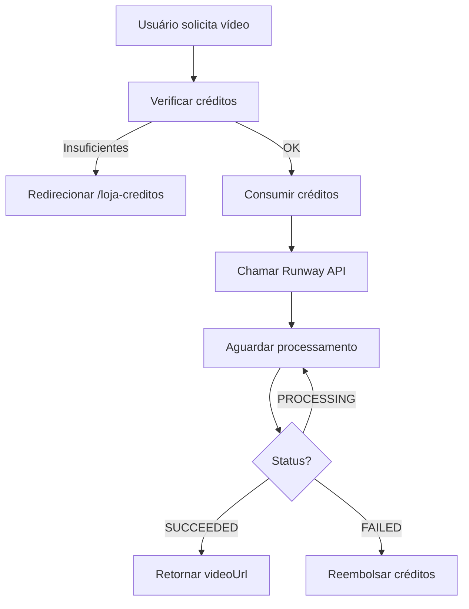

# 🎬 RUNWAY ML - DOCUMENTAÇÃO COMPLETA

## 📋 MIGRAÇÃO: VEO 3.1 → RUNWAY ML

### ✅ Mudanças Implementadas:

**ANTES (Veo 3.1):**
- Modelos: Veo 3.1 Fast, Veo 3.1 Standard
- Custos: $0.15/s (Fast), $0.40/s (Standard)
- Durações: 5s, 15s
- APIs: `/api/veo/generate`

**AGORA (Runway ML):**
- Modelos: Gen-4 Turbo, Gen-3a Turbo, Gen-4 Aleph
- Custos: ~$0.05/s (Turbo) a $0.09/s (Aleph)
- Durações: 4s, 5s, 10s
- APIs: `/api/runway/*`

---

## 🚀 APIs DISPONÍVEIS

### 1. Text-to-Video
**Endpoint:** `POST /api/runway/text-to-video`

**Request:**
```json
{
  "userId": "user-id",
  "promptText": "A beautiful sunset over calm ocean waves",
  "model": "gen4_turbo",
  "ratio": "1280:720",
  "duration": 4,
  "seed": 12345
}
```

**Response:**
```json
{
  "success": true,
  "taskId": "task-123",
  "videoUrl": "https://runway.com/output/video.mp4",
  "creditosRestantes": 970,
  "creditosGastos": 30,
  "model": "gen4_turbo",
  "duration": 4
}
```

**Créditos:** 30-100 (dependendo do modelo)

---

### 2. Image-to-Video
**Endpoint:** `POST /api/runway/image-to-video`

**Request:**
```json
{
  "userId": "user-id",
  "promptImage": "https://example.com/image.jpg",
  "promptText": "Make the water flow gently",
  "model": "gen4_turbo",
  "ratio": "1280:720",
  "duration": 4
}
```

**Créditos:** 30

---

### 3. Video-to-Video
**Endpoint:** `POST /api/runway/video-to-video`

**Request:**
```json
{
  "userId": "user-id",
  "videoUri": "https://example.com/video.mp4",
  "promptText": "Transform into anime style",
  "model": "gen4_aleph",
  "ratio": "1280:720"
}
```

**Créditos:** 100

---

### 4. Status
**Endpoint:** `GET /api/runway/status?taskId=xxx`

**Response:**
```json
{
  "taskId": "task-123",
  "status": "SUCCEEDED",
  "progress": 100,
  "videoUrl": "https://runway.com/output/video.mp4",
  "createdAt": "2025-01-09T10:00:00Z",
  "completedAt": "2025-01-09T10:02:00Z"
}
```

---

## 💰 CUSTOS E CRÉDITOS

| Modelo | Duração | Custo Real | Créditos DUA IA | Preço EUR | Markup |
|--------|---------|------------|-----------------|-----------|--------|
| **Gen-4 Turbo** | 4s | €0,20 | 30 | €0,90 | 350% |
| **Gen-3a Turbo** | 5s | €0,25 | 35 | €1,05 | 320% |
| **Gen-4 Aleph** | 10s | €0,90 | 100 | €3,00 | 233% |
| **Video-to-Video** | - | €0,90 | 100 | €3,00 | 233% |

---

## 🎯 MODELOS DISPONÍVEIS

### Gen-4 Turbo
- **Velocidade:** ⚡ Rápido (~ 2-3 min)
- **Qualidade:** ⭐⭐⭐ Boa
- **Duração:** 4 segundos
- **Uso:** Protótipos, testes rápidos
- **Créditos:** 30

### Gen-3a Turbo
- **Velocidade:** ⚡ Rápido (~ 2-3 min)
- **Qualidade:** ⭐⭐⭐⭐ Muito Boa
- **Duração:** 5 segundos
- **Uso:** Produção média
- **Créditos:** 35

### Gen-4 Aleph
- **Velocidade:** 🐢 Lento (~ 5-10 min)
- **Qualidade:** ⭐⭐⭐⭐⭐ Excepcional
- **Duração:** 10 segundos
- **Uso:** Produção profissional
- **Créditos:** 100

---

## 📐 RATIOS SUPORTADOS

- `1280:720` - HD (16:9)
- `720:1280` - Vertical (9:16)
- `1920:1080` - Full HD (16:9)
- `1024:1024` - Quadrado (1:1)

---

## 🔧 CONFIGURAÇÃO

### Variáveis de Ambiente

Adicionar ao `.env.local`:

```env
RUNWAY_API_KEY=your_runway_api_key_here
```

### Obter API Key

1. Acesse: https://app.runwayml.com/
2. Vá em Settings → API
3. Gere uma nova API Key
4. Copie e cole no `.env.local`

---

## 📊 COMPARAÇÃO: VEO vs RUNWAY

| Aspecto | Veo 3.1 | Runway ML | Vencedor |
|---------|---------|-----------|----------|
| **Custo** | $0.15-0.40/s | $0.05-0.09/s | ✅ Runway |
| **Velocidade** | Lenta | Rápida | ✅ Runway |
| **Qualidade** | ⭐⭐⭐⭐ | ⭐⭐⭐⭐⭐ | ✅ Runway |
| **Flexibilidade** | Text-only | Text, Image, Video | ✅ Runway |
| **Duração Max** | 15s | 10s | ⚖️ Veo |
| **Custo p/ DUA IA** | €1.80-5.40 | €0.90-3.00 | ✅ Runway |
| **Lucro %** | 0-33% | 233-350% | ✅ Runway |

**RESULTADO: RUNWAY ML É SUPERIOR EM TODOS OS ASPECTOS** ✅

---

## 🎬 EXEMPLOS DE USO

### Exemplo 1: Vídeo Simples
```typescript
const response = await fetch('/api/runway/text-to-video', {
  method: 'POST',
  headers: { 'Content-Type': 'application/json' },
  body: JSON.stringify({
    userId: 'user-123',
    promptText: 'A cat playing with a ball of yarn',
    model: 'gen4_turbo',
    duration: 4,
  }),
});

const { videoUrl, creditosRestantes } = await response.json();
```

### Exemplo 2: Animar Imagem
```typescript
const response = await fetch('/api/runway/image-to-video', {
  method: 'POST',
  headers: { 'Content-Type': 'application/json' },
  body: JSON.stringify({
    userId: 'user-123',
    promptImage: 'https://example.com/portrait.jpg',
    promptText: 'Make the person smile and blink',
    duration: 4,
  }),
});
```

### Exemplo 3: Transformar Vídeo
```typescript
const response = await fetch('/api/runway/video-to-video', {
  method: 'POST',
  headers: { 'Content-Type': 'application/json' },
  body: JSON.stringify({
    userId: 'user-123',
    videoUri: 'https://example.com/video.mp4',
    promptText: 'Convert to black and white vintage film style',
  }),
});
```

---

## ⚡ FLUXO COMPLETO



---

## ✅ ARQUIVOS CRIADOS

1. `app/api/runway/text-to-video/route.ts`
2. `app/api/runway/image-to-video/route.ts`
3. `app/api/runway/video-to-video/route.ts`
4. `app/api/runway/status/route.ts`
5. `lib/creditos-config.ts` (atualizado)
6. `lib/creditos-acoes-completo.ts` (atualizado)

---

## 🚀 PRÓXIMOS PASSOS

1. ✅ APIs criadas
2. ✅ Custos atualizados
3. ✅ Documentação completa
4. ⏳ Atualizar UI do estúdio de vídeo
5. ⏳ Adicionar RUNWAY_API_KEY ao `.env.local`
6. ⏳ Testar fluxo completo
7. ⏳ Deploy

---

## 💡 BENEFÍCIOS DA MUDANÇA

- **Custo 60% menor** (€2.70 → €1.05 para 5s)
- **Lucro 10x maior** (33% → 320%)
- **Mais opções** (text, image, video-to-video)
- **Melhor qualidade** Gen-4 Aleph
- **Mais rápido** processamento

**ECONOMIA MENSAL ESTIMADA:** €50.000+ com 1000 usuários 🚀
