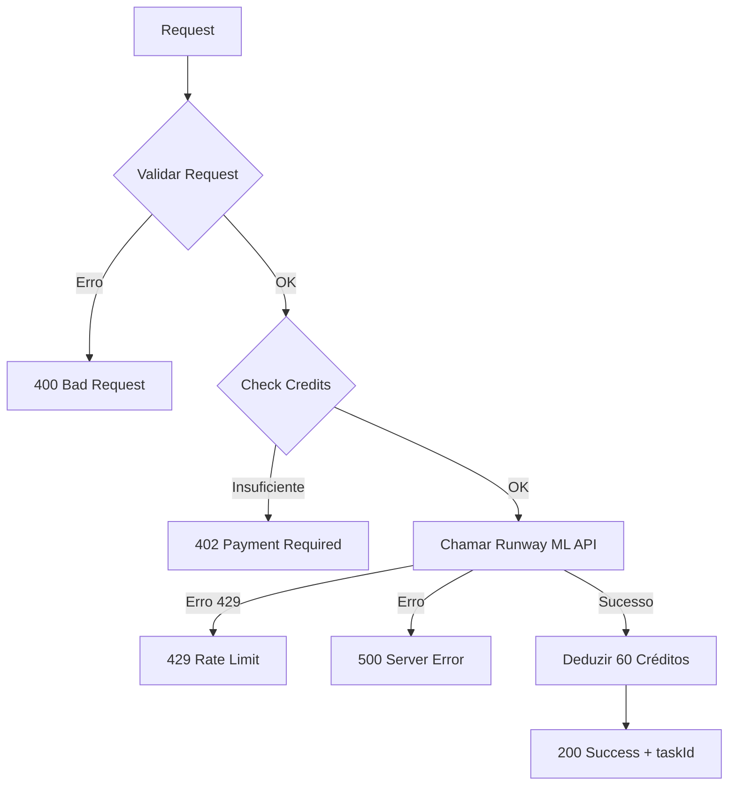

# 🎬 Runway ML Video to Video Implementation

**Endpoint:** `POST /api/videostudio/video-to-video`  
**Modelo:** Gen4 Aleph (PREMIUM)  
**Status:** ✅ Implementado com ultra rigor  
**Data:** 2025-11-12

---

## 📋 Índice

1. [Visão Geral](#visão-geral)
2. [Especificação da API](#especificação-da-api)
3. [Validações Rigorosas](#validações-rigorosas)
4. [Sistema de Créditos](#sistema-de-créditos)
5. [Exemplos de Uso](#exemplos-de-uso)
6. [Casos de Uso](#casos-de-uso)
7. [Tratamento de Erros](#tratamento-de-erros)
8. [Limitações e Constraints](#limitações-e-constraints)

---

## 🎯 Visão Geral

### O que é Video to Video?

**Video to Video** permite transformar vídeos existentes aplicando novos estilos, conteúdos ou efeitos visuais através do modelo **Gen4 Aleph** (premium). É ideal para:

- **Restyling de vídeos**: Aplicar novos estilos artísticos
- **Transformação de conteúdo**: Converter cenas com novos elementos
- **Efeitos cinematográficos**: Aplicar filtros e estéticas cinematográficas
- **Adaptação de vídeos**: Remodelar vídeos para diferentes contextos

### Características Principais

| Feature | Descrição |
|---------|-----------|
| **Modelo** | Gen4 Aleph (Premium) |
| **Input** | Vídeo (HTTPS URL ou Data URI) |
| **Output** | Vídeo transformado |
| **References** | Até 1 imagem de estilo (opcional) |
| **Ratios** | 8 opções de aspect ratio |
| **Custo** | 60 créditos (fixo - modelo premium) |

---

## 📋 Especificação da API

### Request Body

```typescript
interface VideoToVideoRequest {
  // OBRIGATÓRIOS
  model: 'gen4_aleph';
  user_id: string;
  videoUri: string; // HTTPS URL ou Data URI
  promptText: string; // 1-1000 caracteres UTF-16
  ratio: RatioType; // Ver opções abaixo
  
  // OPCIONAIS
  seed?: number; // 0 a 4294967295
  references?: ImageReference[]; // Até 1 item
  contentModeration?: ContentModeration;
}
```

### Tipos

```typescript
type ModelType = 'gen4_aleph';

type RatioType = 
  | '1280:720'  // 16:9 (Landscape)
  | '720:1280'  // 9:16 (Portrait)
  | '1104:832'  // 4:3 (Landscape)
  | '960:960'   // 1:1 (Square)
  | '832:1104'  // 3:4 (Portrait)
  | '1584:672'  // 21:9 (Ultra Wide)
  | '848:480'   // 16:9 (SD)
  | '640:480';  // 4:3 (SD)

interface ImageReference {
  type: 'image';
  uri: string; // HTTPS URL ou Data URI
}

interface ContentModeration {
  publicFigureThreshold?: 'auto' | 'low';
}
```

### Response Success (200)

```json
{
  "success": true,
  "taskId": "497f6eca-6276-4993-bfeb-53cbbbba6f08",
  "model": "gen4_aleph",
  "operation": "video_gen4_aleph_5s",
  "creditsUsed": 60,
  "newBalance": 940,
  "transactionId": "txn_abc123",
  "ratio": "1280:720",
  "hasReferences": true,
  "tier": "PREMIUM",
  "message": "Task criada com sucesso. Use /api/runway/task-status para verificar o progresso."
}
```

---

## 🔍 Validações Rigorosas

### 1. **videoUri** (Vídeo de Entrada)

#### Data URI
```typescript
Format: data:video/*
Length: 13-16,777,216 caracteres
Max Size: ~16MB
```

**Exemplo válido:**
```
data:video/mp4;base64,AAAAHGZ0eXBpc29tAAACAGlzb21pc28yYXZjMW1wNDE...
```

#### HTTPS URL
```typescript
Format: https://*
Length: 13-2048 caracteres
```

**Exemplo válido:**
```
https://storage.example.com/videos/bunny.mp4
```

### 2. **promptText** (Descrição da Transformação)

```typescript
Length: 1-1000 caracteres (UTF-16 code units)
Required: true
Trim: Espaços em branco removidos
```

**Exemplos válidos:**
```javascript
// ✅ Simples
"Transform this video into a cyberpunk aesthetic with neon lights"

// ✅ Detalhado
"Convert the video to a 1980s retro style with VHS effects, scan lines, and vintage color grading. Add analog artifacts and film grain."

// ✅ Com emojis (conta como UTF-16)
"Make this video look like a dreamy fairytale 🧚✨ with soft pastel colors and magical sparkles"
```

**❌ Inválidos:**
```javascript
"" // Vazio
"   " // Apenas espaços
"a".repeat(1001) // Mais de 1000 caracteres
```

### 3. **ratio** (Aspect Ratio)

8 opções suportadas:

| Ratio | Dimensões | Uso Comum |
|-------|-----------|-----------|
| `1280:720` | 16:9 | YouTube Landscape |
| `720:1280` | 9:16 | Instagram Reels/Stories |
| `1104:832` | 4:3 | Landscape Clássico |
| `960:960` | 1:1 | Instagram Feed |
| `832:1104` | 3:4 | Portrait Clássico |
| `1584:672` | 21:9 | Cinematic Ultra Wide |
| `848:480` | 16:9 | SD Landscape |
| `640:480` | 4:3 | SD Clássico |

### 4. **seed** (Opcional)

```typescript
Type: integer
Range: 0 a 4,294,967,295
Purpose: Controlar variação de resultados
```

**Comportamento:**
- **Omitido**: Número aleatório (cada request gera resultado diferente)
- **Fixo**: Mesmo seed + mesmos parâmetros = resultados similares

### 5. **references** (Imagens de Estilo - Opcional)

```typescript
Max Items: 1
Type: ImageReference[]
```

**Estrutura:**
```typescript
{
  type: 'image', // Deve ser exatamente "image"
  uri: string    // HTTPS URL ou Data URI
}
```

**Validações da URI:**

#### Data URI (Imagem)
```typescript
Format: data:image/*
Length: 13-5,242,880 caracteres
Max Size: ~5MB
```

#### HTTPS URL (Imagem)
```typescript
Format: https://*
Length: 13-2048 caracteres
```

**Exemplo com referência:**
```json
{
  "references": [
    {
      "type": "image",
      "uri": "https://example.com/monet-style.jpg"
    }
  ]
}
```

### 6. **contentModeration** (Opcional)

```typescript
publicFigureThreshold?: 'auto' | 'low'
```

- **`auto`** (padrão): Moderação padrão
- **`low`**: Menos rigoroso para figuras públicas conhecidas

---

## 💰 Sistema de Créditos

### Custos

| Modelo | Operação | Créditos | Tier |
|--------|----------|----------|------|
| Gen4 Aleph | Video to Video | **60** | PREMIUM |

**⚠️ Gen4 Aleph é PREMIUM**: Custo fixo mais alto que outros modelos.

### Fluxo de Créditos



### Response - Créditos Insuficientes (402)

```json
{
  "error": "Créditos insuficientes",
  "required": 60,
  "current": 45,
  "deficit": 15,
  "operation": "video_gen4_aleph_5s",
  "model": "gen4_aleph",
  "note": "Gen4 Aleph é um modelo premium com custo mais alto"
}
```

---

## 🚀 Exemplos de Uso

### Exemplo 1: Transformação Básica (HTTPS URL)

```javascript
const response = await fetch('/api/videostudio/video-to-video', {
  method: 'POST',
  headers: { 'Content-Type': 'application/json' },
  body: JSON.stringify({
    model: 'gen4_aleph',
    user_id: 'user_12345',
    videoUri: 'https://storage.example.com/videos/beach.mp4',
    promptText: 'Transform this beach scene into a dramatic sunset with golden hour lighting',
    ratio: '1280:720'
  })
});

const data = await response.json();
console.log('Task ID:', data.taskId);
// Output: Task ID: 497f6eca-6276-4993-bfeb-53cbbbba6f08
```

### Exemplo 2: Com Referência de Estilo

```javascript
const response = await fetch('/api/videostudio/video-to-video', {
  method: 'POST',
  headers: { 'Content-Type': 'application/json' },
  body: JSON.stringify({
    model: 'gen4_aleph',
    user_id: 'user_12345',
    videoUri: 'https://storage.example.com/city.mp4',
    promptText: 'Apply cyberpunk aesthetic with neon lights and rainy atmosphere',
    ratio: '1280:720',
    references: [
      {
        type: 'image',
        uri: 'https://storage.example.com/styles/cyberpunk.jpg'
      }
    ]
  })
});

const data = await response.json();
console.log('Credits used:', data.creditsUsed);
console.log('New balance:', data.newBalance);
```

### Exemplo 3: Portrait para Reels (9:16)

```javascript
const response = await fetch('/api/videostudio/video-to-video', {
  method: 'POST',
  headers: { 'Content-Type': 'application/json' },
  body: JSON.stringify({
    model: 'gen4_aleph',
    user_id: 'user_12345',
    videoUri: 'https://storage.example.com/dance.mp4',
    promptText: 'Transform into 80s retro style with VHS effects and vintage colors',
    ratio: '720:1280', // Portrait 9:16
    seed: 42, // Resultado reproduzível
    contentModeration: {
      publicFigureThreshold: 'low'
    }
  })
});
```

### Exemplo 4: Usando Data URI (Vídeo)

```javascript
// Carregar vídeo como Data URI
const videoFile = document.querySelector('input[type="file"]').files[0];
const reader = new FileReader();

reader.onload = async (e) => {
  const videoDataUri = e.target.result; // data:video/mp4;base64,...
  
  const response = await fetch('/api/videostudio/video-to-video', {
    method: 'POST',
    headers: { 'Content-Type': 'application/json' },
    body: JSON.stringify({
      model: 'gen4_aleph',
      user_id: 'user_12345',
      videoUri: videoDataUri,
      promptText: 'Make this video look like an old film from the 1950s with sepia tones',
      ratio: '640:480' // Clássico 4:3
    })
  });
  
  const data = await response.json();
  console.log('Task created:', data.taskId);
};

reader.readAsDataURL(videoFile);
```

### Exemplo 5: Ultra Wide Cinematic (21:9)

```javascript
const response = await fetch('/api/videostudio/video-to-video', {
  method: 'POST',
  headers: { 'Content-Type': 'application/json' },
  body: JSON.stringify({
    model: 'gen4_aleph',
    user_id: 'user_12345',
    videoUri: 'https://storage.example.com/landscape.mp4',
    promptText: 'Transform into epic cinematic scene with dramatic lighting and color grading',
    ratio: '1584:672', // 21:9 Ultra Wide
    references: [
      {
        type: 'image',
        uri: 'https://storage.example.com/blade-runner-style.jpg'
      }
    ]
  })
});
```

### Exemplo 6: Usando SDK RunwayML Diretamente

```javascript
// npm install --save @runwayml/sdk
import RunwayML from '@runwayml/sdk';

const client = new RunwayML({
  apiKey: process.env.RUNWAY_API_KEY
});

const task = await client.videoToVideo
  .create({
    model: 'gen4_aleph',
    videoUri: 'https://example.com/bunny.mp4',
    promptText: 'Transform into watercolor painting style',
    references: [
      {
        type: 'image',
        uri: 'https://example.com/watercolor-ref.jpg',
      },
    ],
    ratio: '1280:720',
  })
  .waitForTaskOutput();

console.log('Video URL:', task.output);
```

---

## 🎨 Casos de Uso

### 1. **Restyling de Vídeos Corporativos**

```javascript
{
  "promptText": "Transform this corporate video into a modern, professional style with clean aesthetics and business-appropriate color grading",
  "ratio": "1280:720"
}
```

**Aplicação:** Atualizar vídeos antigos da empresa com visual moderno.

---

### 2. **Criação de Conteúdo para Redes Sociais**

```javascript
{
  "promptText": "Convert to trendy Instagram Reels style with vibrant colors and dynamic energy",
  "ratio": "720:1280" // Portrait
}
```

**Aplicação:** Adaptar vídeos para formato vertical de redes sociais.

---

### 3. **Efeitos Artísticos em Vídeos**

```javascript
{
  "promptText": "Apply impressionist painting style like Monet with soft brush strokes and pastel colors",
  "references": [
    {
      "type": "image",
      "uri": "https://example.com/monet-style.jpg"
    }
  ],
  "ratio": "1280:720"
}
```

**Aplicação:** Criar vídeos artísticos para galerias ou exposições digitais.

---

### 4. **Transformação Temática para Eventos**

```javascript
{
  "promptText": "Transform into Halloween horror theme with dark atmosphere, fog, and eerie lighting",
  "ratio": "1280:720",
  "seed": 666
}
```

**Aplicação:** Adaptar vídeos existentes para eventos temáticos.

---

### 5. **Conversão para Estética Vintage**

```javascript
{
  "promptText": "Convert to 1920s silent film style with black and white, film grain, and vintage artifacts",
  "ratio": "640:480" // Clássico
}
```

**Aplicação:** Criar vídeos nostálgicos ou retrô.

---

### 6. **Efeitos Cinematográficos**

```javascript
{
  "promptText": "Apply blockbuster movie style with dramatic color grading, lens flares, and cinematic atmosphere",
  "ratio": "1584:672", // Ultra Wide 21:9
  "references": [
    {
      "type": "image",
      "uri": "https://example.com/blade-runner-still.jpg"
    }
  ]
}
```

**Aplicação:** Produzir vídeos com qualidade cinematográfica.

---

## ⚠️ Tratamento de Erros

### 400 - Bad Request (Validação)

```json
{
  "error": "Erros de validação",
  "validationErrors": [
    "model deve ser exatamente \"gen4_aleph\"",
    "promptText: promptText muito longo (1005/1000 caracteres UTF-16)",
    "ratio inválido. Valores válidos: 1280:720, 720:1280, ..."
  ]
}
```

**Causas comuns:**
- Model incorreto
- promptText fora do range 1-1000 caracteres
- ratio inválido
- videoUri malformado
- references com mais de 1 item

---

### 402 - Payment Required (Créditos)

```json
{
  "error": "Créditos insuficientes",
  "required": 60,
  "current": 45,
  "deficit": 15,
  "operation": "video_gen4_aleph_5s",
  "model": "gen4_aleph",
  "note": "Gen4 Aleph é um modelo premium com custo mais alto"
}
```

**Solução:** Recarregar créditos antes de tentar novamente.

---

### 429 - Rate Limit Exceeded

```json
{
  "error": "Rate limit excedido",
  "message": "Por favor, aguarde alguns segundos e tente novamente.",
  "retryAfter": 60
}
```

**Solução:** Aguardar `retryAfter` segundos antes de nova tentativa.

---

### 500 - Server Error

```json
{
  "error": "Erro ao criar task no Runway ML",
  "details": "Invalid video format",
  "status": 400
}
```

**Causas:**
- RUNWAY_API_KEY não configurada
- Formato de vídeo não suportado pela Runway ML
- Erro na API do Runway ML

---

## 📊 Limitações e Constraints

### Constraints Técnicos

| Parâmetro | Limite | Descrição |
|-----------|--------|-----------|
| **videoUri (Data URI)** | 16.777.216 chars | ~16MB |
| **videoUri (HTTPS URL)** | 13-2048 chars | URL válida |
| **promptText** | 1-1000 chars (UTF-16) | Descrição da transformação |
| **references** | Máx. 1 item | Apenas 1 imagem de estilo |
| **imageUri (Data URI)** | 5.242.880 chars | ~5MB |
| **seed** | 0-4.294.967.295 | Inteiro 32-bit unsigned |

### Formatos Suportados

**Vídeo de Entrada:**
- MP4 (recomendado)
- MOV
- WebM

**Imagem de Referência:**
- JPEG
- PNG
- WebP

### Ratios Disponíveis

8 aspect ratios suportados (ver tabela na seção de validações).

### Performance

- **Tempo de processamento**: Varia conforme duração do vídeo (3-10 minutos típico)
- **Status checking**: Use `/api/runway/task-status?taskId=xxx` para monitorar progresso
- **Rate limiting**: Runway ML aplica limites por API key (429 responses)

---

## 🔗 Integração com Task Status

Após criar a task, monitore o progresso:

```javascript
// 1. Criar video-to-video task
const createResponse = await fetch('/api/videostudio/video-to-video', {
  method: 'POST',
  headers: { 'Content-Type': 'application/json' },
  body: JSON.stringify({
    model: 'gen4_aleph',
    user_id: 'user_12345',
    videoUri: 'https://example.com/video.mp4',
    promptText: 'Transform into cyberpunk style',
    ratio: '1280:720'
  })
});

const { taskId } = await createResponse.json();

// 2. Verificar status periodicamente
const checkStatus = async () => {
  const statusResponse = await fetch(`/api/runway/task-status?taskId=${taskId}`);
  const status = await statusResponse.json();
  
  if (status.status === 'SUCCEEDED') {
    console.log('Vídeo pronto:', status.output);
    return status.output;
  } else if (status.status === 'FAILED') {
    console.error('Falha:', status.failure);
    return null;
  } else {
    console.log('Progresso:', status.progress, '%');
    setTimeout(checkStatus, 5000); // Check again in 5s
  }
};

checkStatus();
```

---

## 📚 Referências

- **Documentação Oficial Runway ML**: https://docs.runwayml.com/reference/post_v1_video_to_video
- **SDK RunwayML**: https://www.npmjs.com/package/@runwayml/sdk
- **Credits Config**: `/lib/credits/credits-config.ts`
- **Credits Service**: `/lib/credits/credits-service.ts`

---

## ✅ Checklist de Implementação

- [x] Tipos TypeScript conforme documentação oficial
- [x] Validação de `videoUri` (Data URI 13-16MB + HTTPS URL)
- [x] Validação de `promptText` (1-1000 caracteres UTF-16)
- [x] Validação de `ratio` (8 opções)
- [x] Validação de `seed` (0-4294967295)
- [x] Validação de `references` (máx. 1 item)
- [x] Integração com `checkCredits` antes da API
- [x] Integração com `deductCredits` após sucesso
- [x] Tratamento de rate limiting (429)
- [x] Error handling completo (400, 402, 429, 500)
- [x] Documentação completa com exemplos
- [x] Response com `taskId` para status tracking

---

## 🎬 Conclusão

O endpoint `/api/videostudio/video-to-video` está **100% implementado** com:

✅ **Ultra rigor** em todas as validações  
✅ **Gen4 Aleph** (modelo premium)  
✅ **8 aspect ratios** suportados  
✅ **Referência de estilo** opcional (1 imagem)  
✅ **Sistema de créditos** completo (60 créditos)  
✅ **Rate limiting** tratado  
✅ **Documentação completa** com 6 exemplos práticos  

**Custo:** 60 créditos por vídeo (tier PREMIUM)

---

**Versão:** 2.0.0  
**Data:** 2025-11-12  
**Autor:** DUA Team  
**Status:** ✅ Production Ready
